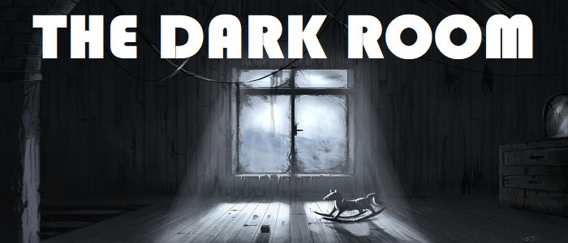

# Project: TheDarkRoom



TheDarkRoom is an interactive web terminal game where you type commands to explore a mysterious room. Your goal is to find the key and escape before time runs out. Solve puzzles, uncover clues, and unlock the door to freedom!

## 📑 Content
- [Description](#description)
- [Functionalities](#-functionalities)
- [Installation](#-installation)
- [Commands](#-commands)
- [Project Stucture](#-project-structure)
- [Planned Features](#-planned-features)

## 📝 Description
This is a simple text-based adventure game where you interact with a terminal and input commands like `forward`, `right`, `left`, `back`, and `get`. The goal of the game is to find the key to escape the room. Throughout the game, you will encounter various interesting items that may be used for different purposes, aiding you in your quest to escape. Navigate through the room, solve challenges, and discover hidden items that could be the key to your freedom.

## ⚙️ Functionalities
- **Navigation**: The player can move around the room by entering commands.
- **Exploring the room**: Each time the player moves, their coordinates in the room are updated.
- **Finding items**: The player can discover items that are randomly placed around the room.

## 💻 Installation
1. Clone or download the project:

    ```bash
    git clone https://github.com/yourusername/TheDarkRoom.git
    ```

2. Open the project in your favorite code editor.

3. Open the `index.html` file in your browser to run the game locally.

## 🧭 Commands
- ❓ **Help**: Show all commands 
- ⬆️ **Forward**: Move one foot forward 
- ⬇️ **Back**: Move one foot back 
- ➡️ **Right**: Move to the right 
- ⬅️ **Left**: Move to the left 
- 🎁 **Get**: You can get an item 
- 📦 **Inventory**: Show your collected items 

## 📁 Project Structure
```bash
TheDarkRoom/
│
├── assets/                     # Static resources (logo, images, etc.)
│   └── TheDarkRoomLogo.png      # Game logo
│
├── src/                        # Source code of the game
│   ├── game/                   # Game logic
│   │   ├── room.js             # Room logic (positions, items)
│   │   ├── player.js           # Player logic (movement, inventory)
│   │   ├── inventory.js        # Inventory logic
│   │   └── commands.js         # Command logic (forward, right, get, etc.)
│   │
│   ├── ui/                     # User interface management
│   │   ├── terminal.js         # Terminal output display
│   │   ├── inputHandler.js     # Command input handler
│   │   └── display.js          # Output result display
│   │
│   └── utils/                  # Utility functions
│       └── random.js           # Random item/event generation
│
├── index.html                  # Main HTML file
├── style.css                   # Game styles
├── app.js                      # Main JS file that connects all components
└── README.md                   # Project documentation
```

## 🛠️ Planned Features
- Save game progress
- Add sound effects
- Create multiple levels

